<!-- GitHub profile README for github.com/RealYusufIsmail -->
<!-- External visuals: capsule-render (banner), readme-typing-svg (animated subtitle). -->
<!-- Local visuals: generated by .github/workflows/profile-visuals.yml. -->

  

<strong>Founder &amp; CEO, <a href="https://apprenticewizard.co.uk">Apprentice Wizard</a></strong> · <strong>Infrastructure Engineering Degree Apprentice, J.P. Morgan</strong>

---

## 👋 A little about me

**I build things I needed and couldn't find.**

I started teaching myself to code in **Year 8, aged 13, during the 2020 COVID-19 lockdown**. What began as curiosity turned into Minecraft mods, open-source libraries, bots and eventually a platform designed to make opportunities easier to access.

Those Minecraft mods have since reached **190,000+ downloads**. Today, I'm the founder of **[Apprentice Wizard](https://apprenticewizard.co.uk)**, helping students discover apprenticeships, organise applications and prepare with practical tools.

Alongside building products, I work as an **Infrastructure Engineering Degree Apprentice at J.P. Morgan**, studying **Digital and Technology Solutions at the University of Exeter**, with a focus on software engineering.

> [!NOTE]
> **How I think:** A pilot should understand how the plane flies, not just which buttons to press. Learn the fundamentals, understand the tools, *then* put them to work.

## 🚀 Currently building: Apprentice Wizard

**[Apprentice Wizard](https://apprenticewizard.co.uk)** is an application platform for UK students navigating apprenticeships — from discovering opportunities to getting interview-ready.

| Discover | Organise | Prepare |
| :--- | :--- | :--- |
| **15,000+ live roles** to explore | Application tracker to keep on top of progress | CV tools and AI-assisted interview preparation |

Built with `Next.js` · `TypeScript` · `React` · `PostgreSQL` · `Supabase` · `Vercel`.

**The goal:** Make high-quality apprenticeship guidance and opportunities more accessible, especially to students who don't already have the right connections.

[**Explore Apprentice Wizard →**](https://apprenticewizard.co.uk)

## 🧰 The technologies I work with

<table>
  <tr>
    <td><strong>Languages</strong></td>
    <td>
      
      
      
      
    </td>
  </tr>
  <tr>
    <td><strong>Frontend</strong></td>
    <td>
      
      
      
    </td>
  </tr>
  <tr>
    <td><strong>Backend & data</strong></td>
    <td>
      
      
      
      
    </td>
  </tr>
  <tr>
    <td><strong>Tools & deployment</strong></td>
    <td>
      
      
      
      
    </td>
  </tr>
</table>

## 🛠️ Selected projects

| Project | What I built | Technology / impact |
| :--- | :--- | :--- |
| 📚 **[YDWK](https://github.com/YDWK/YDWK)** | An asynchronous Discord API wrapper built from scratch. | `Kotlin` · `Coroutines` |
| 🛡️ **[MystiGuardian](https://github.com/BotCraftHub/MystiGuardian)** | Moderation and utility bot for a community of around 3,000 members. | `Java` · `jOOQ` |
| 🦸 **[Ben 10 Mod](https://www.curseforge.com/members/realyusufismail/projects)** | Minecraft heroes, villains, armour and items inspired by the series. | `Java` · **118.8K downloads** |
| ⚙️ **[RealYusufIsmail Core](https://www.curseforge.com/members/realyusufismail/projects)** | Shared library powering my Minecraft mods. | `Java` · **53.5K downloads** |
| ⏳ **[TemporalSmith](https://www.curseforge.com/members/realyusufismail/projects)** | Time-themed weapons, tools and dimensions for Minecraft. | `Java` · **15.1K downloads** |
| 🧩 **[JConfig](https://github.com/RealYusufIsmail/JConfig)** | Lightweight JSON configuration library. | `Java` · `Kotlin` |

**Open source:** I've also contributed to **[Javacord](https://github.com/Javacord/Javacord)**, a Java library for building Discord bots.

[**See more repositories →**](https://github.com/realyusufismail?tab=repositories)

## 🏆 Recognition & milestones

- 🥇 **Academic Achievement in Computer Science** — one of two recipients in my Year 13 cohort.
- ⭐ **Principal's Star Academies Pupil Award** — sole recipient in my year group.
- 🎮 **190,000+ Minecraft mod downloads** — projects rooted in a journey that began at 13.
- 💼 **From startup internships to infrastructure engineering** at J.P. Morgan.

## 📈 GitHub in motion

<!-- These local SVG files are generated by .github/workflows/profile-visuals.yml. -->

  <picture>
    <source media="(prefers-color-scheme: dark)" srcset="./assets/stats-dark.svg" />
    <source media="(prefers-color-scheme: light)" srcset="./assets/stats-light.svg" />
    
  </picture>
  <picture>
    <source media="(prefers-color-scheme: dark)" srcset="./assets/languages-dark.svg" />
    <source media="(prefers-color-scheme: light)" srcset="./assets/languages-light.svg" />
    
  </picture>

  <picture>
    <source media="(prefers-color-scheme: dark)" srcset="./assets/snake-dark.svg" />
    <source media="(prefers-color-scheme: light)" srcset="./assets/snake-light.svg" />
    
  </picture>

GitHub visuals are generated by a scheduled workflow and reflect publicly accessible GitHub activity. Language usage isn't a measure of proficiency.

---

<h3 align="center">🤝 Let's connect</h3>

Interested in <strong>open source</strong>, <strong>education</strong>, <strong>apprenticeships</strong> or <strong>building useful software</strong>? I'd love to connect.

<i>Always building, always learning. Alḥamdulillāh.</i>

